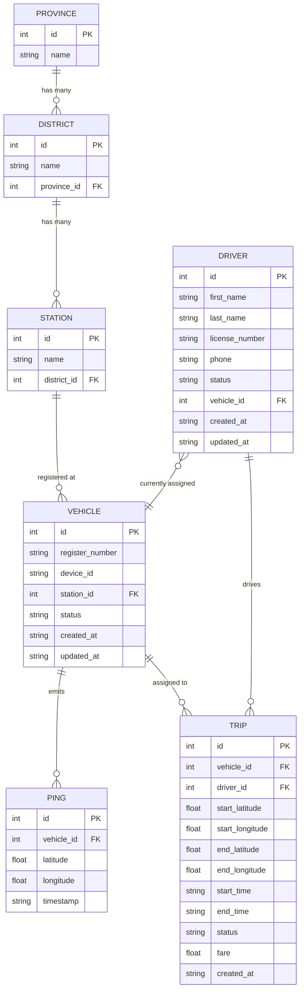

# 🚕 Taxi Company Vehicle Tracking — REST API Project Plan

> **Student Session:** COBSCCOMP251P-059  
> **Module:** NB6007CEM — Web API Development  
> **Stack:** Node.js · Express 5 · In-Memory JSON Data · Swagger UI  
> **Deployment:** Vercel (Serverless)

---

## 1. Business Context

A Sri Lankan taxi company needs a centralised REST API to:

- **Register & manage vehicles** across police-station jurisdictions.
- **Track real-time GPS locations** via device pings.
- **Manage drivers** and their assignment to vehicles.
- **Record trips** from pickup to drop-off with fare calculation.
- **Query geographic hierarchies** (Province → District → Station) for operational reporting.

The API is consumed by a dispatcher dashboard, a driver mobile app, and third-party analytics tools.

---

## 2. Data Model

### 2.1 Entity-Relationship Diagram



### 2.2 Entity Descriptions

| Entity | Purpose | Key Business Rules |
|---|---|---|
| **Province** | Top-level geographic division (9 provinces in Sri Lanka) | Read-only reference data |
| **District** | Second-level geographic division, belongs to a Province | Read-only reference data |
| **Station** | Police station / taxi stand, belongs to a District | Read-only reference data |
| **Vehicle** | A taxi registered at a Station with a GPS tracking device | `register_number` must be unique; `status` ∈ {`active`, `inactive`, `maintenance`} |
| **Driver** | A person licensed to drive a taxi | `license_number` must be unique; `status` ∈ {`available`, `on_trip`, `off_duty`}; optionally assigned to one Vehicle |
| **Ping** | A single GPS coordinate emitted by a Vehicle's device | Immutable after creation; ordered by `timestamp` |
| **Trip** | A passenger journey from point A to point B | `status` ∈ {`ongoing`, `completed`, `cancelled`}; linked to exactly one Vehicle and one Driver |

### 2.3 Field Specifications

#### Vehicle

| Field | Type | Required | Constraints | Description |
|---|---|---|---|---|
| `id` | Integer | Auto | Primary key | Unique identifier |
| `register_number` | String | Yes | Unique, non-empty | License plate (e.g. `HB-6168`) |
| `device_id` | String | Yes | Unique, non-empty | GPS tracker ID (e.g. `TUK-DEV-520651`) |
| `station_id` | Integer | Yes | Must reference valid Station | Registered station |
| `status` | String | No | Default: `active` | One of `active`, `inactive`, `maintenance` |
| `created_at` | ISO 8601 | Auto | Server-generated | Creation timestamp |
| `updated_at` | ISO 8601 | Auto | Server-generated | Last update timestamp |

#### Driver

| Field | Type | Required | Constraints | Description |
|---|---|---|---|---|
| `id` | Integer | Auto | Primary key | Unique identifier |
| `first_name` | String | Yes | Non-empty | Driver's first name |
| `last_name` | String | Yes | Non-empty | Driver's last name |
| `license_number` | String | Yes | Unique, non-empty | Driving license ID |
| `phone` | String | Yes | Non-empty | Contact number |
| `status` | String | No | Default: `available` | One of `available`, `on_trip`, `off_duty` |
| `vehicle_id` | Integer | No | Must reference valid Vehicle or `null` | Currently assigned vehicle |
| `created_at` | ISO 8601 | Auto | Server-generated | Creation timestamp |
| `updated_at` | ISO 8601 | Auto | Server-generated | Last update timestamp |

#### Ping

| Field | Type | Required | Constraints | Description |
|---|---|---|---|---|
| `id` | Integer | Auto | Primary key | Unique identifier |
| `vehicle_id` | Integer | Yes | Must reference valid Vehicle | Source vehicle |
| `latitude` | Number | Yes | -90 to 90 | GPS latitude |
| `longitude` | Number | Yes | -180 to 180 | GPS longitude |
| `timestamp` | ISO 8601 | Yes | Valid date-time | When the ping was recorded |

#### Trip

| Field | Type | Required | Constraints | Description |
|---|---|---|---|---|
| `id` | Integer | Auto | Primary key | Unique identifier |
| `vehicle_id` | Integer | Yes | Must reference valid Vehicle | Taxi used |
| `driver_id` | Integer | Yes | Must reference valid Driver | Driver on duty |
| `start_latitude` | Number | Yes | -90 to 90 | Pickup latitude |
| `start_longitude` | Number | Yes | -180 to 180 | Pickup longitude |
| `end_latitude` | Number | No | -90 to 90 | Drop-off latitude (set on completion) |
| `end_longitude` | Number | No | -180 to 180 | Drop-off longitude (set on completion) |
| `start_time` | ISO 8601 | Yes | Valid date-time | Trip start |
| `end_time` | ISO 8601 | No | Must be after `start_time` | Trip end (set on completion) |
| `status` | String | No | Default: `ongoing` | One of `ongoing`, `completed`, `cancelled` |
| `fare` | Number | No | ≥ 0 | Fare in LKR (set on completion) |
| `created_at` | ISO 8601 | Auto | Server-generated | Creation timestamp |

---

## 3. API Routes

### 3.1 Route Summary Table

> All routes are prefixed with the base URL (e.g. `http://localhost:3000`).  
> **C** = Create, **R** = Read, **U** = Update, **D** = Delete

| # | Method | Endpoint | Operation | Description |
|---|---|---|---|---|
| | | **Health** | | |
| 1 | `GET` | `/` | R | Health check & session info |
| | | **Provinces (Reference)** | | |
| 2 | `GET` | `/provinces` | R | List all provinces |
| 3 | `GET` | `/provinces/:id` | R | Get one province |
| 4 | `GET` | `/provinces/:id/districts` | R | List districts within a province |
| | | **Districts (Reference)** | | |
| 5 | `GET` | `/districts` | R | List all districts |
| 6 | `GET` | `/districts/:id` | R | Get one district |
| 7 | `GET` | `/districts/:id/stations` | R | List stations within a district |
| | | **Stations (Reference)** | | |
| 8 | `GET` | `/stations` | R | List all stations |
| 9 | `GET` | `/stations/:id` | R | Get one station |
| 10 | `GET` | `/stations/:id/vehicles` | R | List vehicles registered at a station |
| | | **Vehicles (Full CRUD)** | | |
| 11 | `GET` | `/vehicles` | R | List all vehicles (with last ping) |
| 12 | `GET` | `/vehicles/:id` | R | Get one vehicle (with last ping) |
| 13 | `POST` | `/vehicles` | C | Register a new vehicle |
| 14 | `PUT` | `/vehicles/:id` | U | Update vehicle details |
| 15 | `DELETE` | `/vehicles/:id` | D | Remove a vehicle |
| 16 | `GET` | `/vehicles/:id/pings` | R | Get GPS ping history for a vehicle |
| 17 | `POST` | `/vehicles/:id/pings` | C | Record a new GPS ping |
| | | **Drivers (Full CRUD)** | | |
| 18 | `GET` | `/drivers` | R | List all drivers |
| 19 | `GET` | `/drivers/:id` | R | Get one driver (with assigned vehicle) |
| 20 | `POST` | `/drivers` | C | Register a new driver |
| 21 | `PUT` | `/drivers/:id` | U | Update driver details |
| 22 | `DELETE` | `/drivers/:id` | D | Remove a driver |
| | | **Trips (Full CRUD)** | | |
| 23 | `GET` | `/trips` | R | List all trips (filterable by status) |
| 24 | `GET` | `/trips/:id` | R | Get one trip |
| 25 | `POST` | `/trips` | C | Start a new trip |
| 26 | `PUT` | `/trips/:id` | U | Update / complete / cancel a trip |
| 27 | `DELETE` | `/trips/:id` | D | Remove a trip record |

### 3.2 Nested / Relationship Routes

These routes express parent–child relationships and **do not** require separate controllers — they filter child data by parent ID.

| Method | Endpoint | Returns |
|---|---|---|
| `GET` | `/provinces/:id/districts` | Districts where `province_id` = `:id` |
| `GET` | `/districts/:id/stations` | Stations where `district_id` = `:id` |
| `GET` | `/stations/:id/vehicles` | Vehicles where `station_id` = `:id` |
| `GET` | `/vehicles/:id/pings` | Pings where `vehicle_id` = `:id` |
| `POST` | `/vehicles/:id/pings` | Create a Ping under the given Vehicle |

### 3.3 Query Parameters (Filtering & Pagination)

| Route | Parameter | Type | Example | Description |
|---|---|---|---|---|
| `GET /vehicles` | `status` | String | `?status=active` | Filter by vehicle status |
| `GET /vehicles` | `station_id` | Integer | `?station_id=4` | Filter by station |
| `GET /drivers` | `status` | String | `?status=available` | Filter by driver status |
| `GET /drivers` | `vehicle_id` | Integer | `?vehicle_id=1` | Filter by assigned vehicle |
| `GET /trips` | `status` | String | `?status=ongoing` | Filter by trip status |
| `GET /trips` | `driver_id` | Integer | `?driver_id=2` | Filter by driver |
| `GET /trips` | `vehicle_id` | Integer | `?vehicle_id=3` | Filter by vehicle |
| All list `GET` | `page` | Integer | `?page=2` | Page number (default: `1`) |
| All list `GET` | `limit` | Integer | `?limit=20` | Items per page (default: `10`, max: `100`) |

---

## 4. Resource Representations (JSON)

### 4.1 Province

```json
{
  "id": 1,
  "name": "Western Province"
}
```

### 4.2 District

```json
{
  "id": 1,
  "name": "Colombo",
  "province_id": 1
}
```

### 4.3 Station

```json
{
  "id": 1,
  "name": "Colombo Police Station",
  "district_id": 1
}
```

### 4.4 Vehicle

**Response (GET):**
```json
{
  "id": 1,
  "register_number": "HB-6168",
  "device_id": "TUK-DEV-520651",
  "station_id": 4,
  "status": "active",
  "created_at": "2026-06-14T00:00:00Z",
  "updated_at": "2026-06-14T00:00:00Z",
  "last_ping": {
    "id": 42,
    "vehicle_id": 1,
    "latitude": 7.312694,
    "longitude": 80.60383,
    "timestamp": "2026-06-14T08:30:00Z"
  }
}
```

**Request Body (POST / PUT):**
```json
{
  "register_number": "HB-6168",
  "device_id": "TUK-DEV-520651",
  "station_id": 4,
  "status": "active"
}
```

### 4.5 Driver

**Response (GET):**
```json
{
  "id": 1,
  "first_name": "Kamal",
  "last_name": "Perera",
  "license_number": "B-1234567",
  "phone": "+94771234567",
  "status": "available",
  "vehicle_id": 1,
  "created_at": "2026-06-14T00:00:00Z",
  "updated_at": "2026-06-14T00:00:00Z"
}
```

**Request Body (POST / PUT):**
```json
{
  "first_name": "Kamal",
  "last_name": "Perera",
  "license_number": "B-1234567",
  "phone": "+94771234567",
  "status": "available",
  "vehicle_id": 1
}
```

### 4.6 Ping

**Response (GET):**
```json
{
  "id": 1,
  "vehicle_id": 1,
  "latitude": 7.312694,
  "longitude": 80.60383,
  "timestamp": "2026-06-14T08:30:00Z"
}
```

**Request Body (POST):**
```json
{
  "latitude": 7.312694,
  "longitude": 80.60383,
  "timestamp": "2026-06-14T08:30:00Z"
}
```
> `vehicle_id` is inferred from the URL path (`/vehicles/:id/pings`).

### 4.7 Trip

**Response (GET):**
```json
{
  "id": 1,
  "vehicle_id": 1,
  "driver_id": 1,
  "start_latitude": 6.9271,
  "start_longitude": 79.8612,
  "end_latitude": 7.2906,
  "end_longitude": 80.6337,
  "start_time": "2026-06-14T09:00:00Z",
  "end_time": "2026-06-14T10:45:00Z",
  "status": "completed",
  "fare": 3500.00,
  "created_at": "2026-06-14T09:00:00Z"
}
```

**Request Body (POST — start trip):**
```json
{
  "vehicle_id": 1,
  "driver_id": 1,
  "start_latitude": 6.9271,
  "start_longitude": 79.8612,
  "start_time": "2026-06-14T09:00:00Z"
}
```

**Request Body (PUT — complete trip):**
```json
{
  "end_latitude": 7.2906,
  "end_longitude": 80.6337,
  "end_time": "2026-06-14T10:45:00Z",
  "status": "completed",
  "fare": 3500.00
}
```

### 4.8 Standard Response Envelopes

**Success — Single Resource:**
```json
{
  "id": 1,
  "register_number": "HB-6168",
  "..."
}
```

**Success — Collection (Paginated):**
```json
{
  "data": [ ... ],
  "pagination": {
    "page": 1,
    "limit": 10,
    "total": 87,
    "totalPages": 9
  }
}
```

**Error:**
```json
{
  "error": "Vehicle not found"
}
```

**Validation Error (400):**
```json
{
  "error": "Validation failed",
  "details": [
    { "field": "register_number", "message": "register_number is required" },
    { "field": "station_id", "message": "station_id must reference a valid station" }
  ]
}
```

---

## 5. HTTP Status Codes

| Code | Meaning | Used For |
|---|---|---|
| `200` | OK | Successful GET, PUT |
| `201` | Created | Successful POST |
| `204` | No Content | Successful DELETE |
| `400` | Bad Request | Validation failure, malformed JSON |
| `404` | Not Found | Resource does not exist |
| `409` | Conflict | Duplicate `register_number` or `license_number` |
| `500` | Internal Server Error | Unexpected server failure |

---

## 6. Project File Structure

```
WebAPIDev-Test/
├── api/
│   ├── server.js              # Express app entry point, middleware, Swagger
│   ├── seed.json              # In-memory seed data (existing + new entities)
│   ├── routes/
│   │   ├── provinces.js       # Province routes
│   │   ├── districts.js       # District routes
│   │   ├── stations.js        # Station routes
│   │   ├── vehicles.js        # Vehicle CRUD + nested pings
│   │   ├── drivers.js         # Driver CRUD
│   │   └── trips.js           # Trip CRUD
│   ├── middleware/
│   │   └── validate.js        # Request body validation helpers
│   └── helpers/
│       ├── pagination.js      # Pagination utility
│       └── idGenerator.js     # Auto-increment ID generator
├── swagger.json               # OpenAPI 3.0 specification
├── package.json
├── vercel.json
├── Project.md                 # ← This document
└── README.md
```

---

## 7. Architecture Decisions

| Decision | Rationale |
|---|---|
| **In-memory JSON store** (no database) | Keeps the project self-contained for academic submission; `seed.json` is loaded once at startup. Data resets on redeploy. |
| **Express 5** | Already in use; provides modern async error handling. |
| **Modular route files** | Separates concerns; each resource gets its own file under `api/routes/`. |
| **Flat resource URLs** | Follows REST conventions (`/vehicles`, `/drivers`, `/trips`) with nested routes only for strong parent–child relationships. |
| **Pagination on all list endpoints** | Prevents oversized responses; critical for Pings which can grow very large. |
| **Swagger UI** | Self-documenting API via `/api-docs`; specification maintained in `swagger.json`. |
| **Vercel deployment** | Existing setup; serverless function via `module.exports = app`. |

---

## 8. Validation Rules Summary

| Entity | Field | Rule |
|---|---|---|
| Vehicle | `register_number` | Required, unique across all vehicles |
| Vehicle | `device_id` | Required, unique across all vehicles |
| Vehicle | `station_id` | Required, must reference an existing Station |
| Vehicle | `status` | Must be one of: `active`, `inactive`, `maintenance` |
| Driver | `first_name`, `last_name` | Required, non-empty strings |
| Driver | `license_number` | Required, unique across all drivers |
| Driver | `phone` | Required, non-empty string |
| Driver | `status` | Must be one of: `available`, `on_trip`, `off_duty` |
| Driver | `vehicle_id` | If provided, must reference an existing Vehicle |
| Ping | `latitude` | Required, number between -90 and 90 |
| Ping | `longitude` | Required, number between -180 and 180 |
| Ping | `timestamp` | Required, valid ISO 8601 date-time |
| Trip | `vehicle_id` | Required, must reference an existing Vehicle |
| Trip | `driver_id` | Required, must reference an existing Driver |
| Trip | `start_latitude`, `start_longitude` | Required, valid coordinate range |
| Trip | `start_time` | Required, valid ISO 8601 date-time |
| Trip | `status` | Must be one of: `ongoing`, `completed`, `cancelled` |
| Trip | `fare` | If provided, must be ≥ 0 |
| Trip | `end_time` | If provided, must be after `start_time` |

---

## 9. Implementation Phases

### Phase 1 — Refactor Existing Code
- [ ] Extract existing routes into modular files under `api/routes/`
- [ ] Add `express.json()` middleware for parsing request bodies
- [ ] Create pagination and ID-generation helpers

### Phase 2 — Vehicle CRUD & Pings
- [ ] Add `POST /vehicles` with validation
- [ ] Add `PUT /vehicles/:id` with validation
- [ ] Add `DELETE /vehicles/:id`
- [ ] Add `POST /vehicles/:id/pings`
- [ ] Add `GET /stations/:id/vehicles` nested route
- [ ] Extend `seed.json` with `status`, `created_at`, `updated_at` fields

### Phase 3 — Drivers
- [ ] Add `GET /drivers`, `GET /drivers/:id`
- [ ] Add `POST /drivers` with validation
- [ ] Add `PUT /drivers/:id`
- [ ] Add `DELETE /drivers/:id`
- [ ] Add driver seed data to `seed.json`

### Phase 4 — Trips
- [ ] Add `GET /trips`, `GET /trips/:id`
- [ ] Add `POST /trips` (start a trip)
- [ ] Add `PUT /trips/:id` (complete / cancel a trip)
- [ ] Add `DELETE /trips/:id`
- [ ] Add trip seed data to `seed.json`

### Phase 5 — Nested Routes & Filtering
- [ ] Add `GET /provinces/:id/districts`
- [ ] Add `GET /districts/:id/stations`
- [ ] Implement query-parameter filtering on list endpoints
- [ ] Implement pagination on all collection endpoints

### Phase 6 — Swagger & Documentation
- [ ] Update `swagger.json` with all new paths, schemas, and examples
- [ ] Verify all endpoints render correctly in Swagger UI

### Phase 7 — Testing & Deployment
- [ ] Manual test every endpoint via Swagger UI / Postman
- [ ] Verify Vercel deployment works with new routes
- [ ] Final review of Project.md

---

*Document created: 2026-07-05 — Last updated: 2026-07-05*
